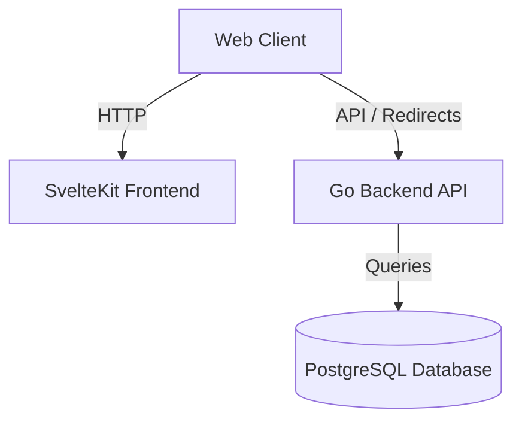

# URL Shortener (Day 6 DevOps Project)

This project contains a URL Shortener application built using a **Go** backend API and a **SvelteKit** frontend, powered by **PostgreSQL**.

The application is containerized and configured for local development using **Docker Compose** or deployment to a local **Kubernetes** cluster (**Kind**) using **Kustomize** and **Helm**.

---

## Architecture Overview



---

## 1. Local Development (Docker Compose)

The fastest way to run and develop the application locally is via Docker Compose:

```bash
docker-compose up --build
```

- **Frontend**: http://localhost:5173
- **Backend API**: http://localhost:8080
- **Postgres**: localhost:5432

---

## 2. Kubernetes Local Registry Setup (Kind)

To test the full deployment workflow inside a Kubernetes cluster without pushing images to Docker Hub or Github Container Registry, we use a local Docker-in-Docker registry with a [Kind (Kubernetes in Docker)](https://kind.sigs.k8s.io/) cluster.

### Step 1: Start the Local Registry
Run a local registry container on port 5000:
```bash
docker run -d -p 5000:5000 --name registry registry:2
```

### Step 2: Create the Kind Cluster
Create a cluster named `url-shortner-demo`:
```bash
kind create cluster --name=url-shortner-demo
```

### Step 3: Connect the Registry to the Cluster Network
Kind nodes run as Docker containers on a Docker network named `kind`. The local registry needs to be on this network so the cluster nodes can access it:
```bash
docker network connect kind registry
```

### Step 4: Configure containerd on the Kind Control Plane Node
We must tell containerd inside the Kind node(s) to route requests for `localhost:5000` to the docker container named `registry:5000`:
```bash
docker exec url-shortner-demo-control-plane sh -c \
  'mkdir -p /etc/containerd/certs.d/localhost:5000 && \
   cat <<EOF > /etc/containerd/certs.d/localhost:5000/hosts.toml
server = "http://registry:5000"

[host."http://registry:5000"]
  capabilities = ["pull", "resolve"]
EOF'
```

### Step 5: Tag and Push Local Images
Once configured, tag your locally built images and push them to Docker Hub:
```bash
# Tag frontend & backend
docker tag 06__day-frontend:latest shaharyarshakir/url-shortener-frontend:latest
docker tag 06__day-backend:latest shaharyarshakir/url-shortener-backend:latest

# Push to Docker Hub
docker push shaharyarshakir/url-shortener-frontend:latest
docker push shaharyarshakir/url-shortener-backend:latest
```

### Step 6: Verify Image Resolution Inside Kind Node (Optional)
Ensure the Kind node can pull the images directly via containerd (`crictl`):
```bash
docker exec url-shortner-demo-control-plane crictl pull shaharyarshakir/url-shortener-frontend:latest
docker exec url-shortner-demo-control-plane crictl pull shaharyarshakir/url-shortener-backend:latest
```

---

## 3. Deploying to Kubernetes

Deployments are managed via **Kustomize** compiling the **Helm** templates.

### Development Configuration
The dev environment overrides default Helm values to use our Docker Hub repository. This is defined in `kustomize/overlays/dev/values.yaml`:

```yaml
namespace: url-shortener-dev

backend:
  replicaCount: 1
  image:
    repository: shaharyarshakir/url-shortener-backend
    tag: latest

frontend:
  replicaCount: 1
  image:
    repository: shaharyarshakir/url-shortener-frontend
    tag: latest

vault:
  enabled: false

ingress:
  enabled: false

postgres:
  storage: 5Gi
```

### Apply Manifests
Deploy the development overlay with Helm chart inflation enabled:
```bash
kubectl kustomize kustomize/overlays/dev --enable-helm | kubectl apply -f -
```

### Verify Deployment
Verify that the pods in the `url-shortener-dev` namespace are pulled and running:
```bash
kubectl get pods -n url-shortener-dev
```