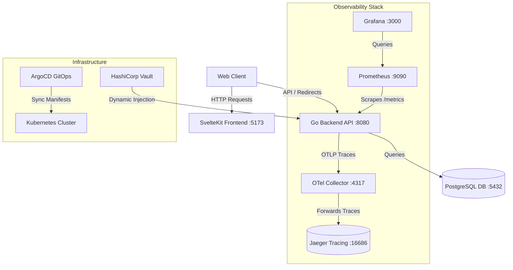

# Production-Grade URL Shortener with GitOps and Observability

A production-grade, containerized URL Shortener application consisting of a **Go backend API**, a **SvelteKit frontend**, and a **PostgreSQL database**. 

This repository demonstrates modern DevOps best practices, featuring a GitOps continuous delivery pipeline (GitHub Actions -> ArgoCD), dynamic secret injection (HashiCorp Vault), and a complete observability stack (OpenTelemetry, Jaeger, Prometheus, and Grafana).

---

## Technical Stack

* **Frontend**: SvelteKit (Svelte 5), Vite, Tailwind CSS, TypeScript, Node.js
* **Backend**: Go 1.26, standard `net/http` router, `pgx` driver
* **Database**: PostgreSQL 17-alpine
* **CI/CD**: GitHub Actions, ArgoCD, Helm, Kustomize, `yq`
* **Secrets Management**: HashiCorp Vault with Kubernetes Auth Method and Vault Agent Injector
* **Observability (Logging)**: Structured JSON access logging to stdout with auto-injected trace context
* **Observability (Monitoring)**: Prometheus metrics endpoint (`/metrics`), Grafana dashboard
* **Observability (Tracing)**: OpenTelemetry (OTLP gRPC), OpenTelemetry Collector, Jaeger Tracing

---

## Architecture Diagram



---

## 1. Local Development & Testing (Docker Compose)

The easiest way to run the entire application stack—including all telemetry, metrics, and tracing databases—is using Docker Compose.

### Quick Start
From the project root directory, spin up all containers:
```bash
docker compose up --build
```
This automatically runs database migrations, configures tracing exporters, and boots up all dashboards.

### Local Ports & Dashboards

* **Frontend App**: [http://localhost:5173](http://localhost:5173) (Shorten URLs and test redirects here)
* **Backend API**: [http://localhost:8080](http://localhost:8080)
* **Jaeger (Distributed Tracing)**: [http://localhost:16686](http://localhost:16686) (Find trace spans for API calls and DB queries)
* **Prometheus (Metrics Console)**: [http://localhost:9090](http://localhost:9090) (Query raw metrics like `requests_total`)
* **Grafana (Metrics Visualizer)**: [http://localhost:3000](http://localhost:3000) (Default Admin access preconfigured)
* **PostgreSQL Database**: `localhost:5432`


---

## 2. Production Deployment & GitOps Pipeline

In production, the application is deployed into a Kubernetes cluster using a GitOps workflow.

### Continuous Integration (CI)
Our GitHub Actions workflow ([ci.yaml](file:///home/shaharyar/01__git_repos/30-day-30-devops-projects/06__day/.github/workflows/ci.yaml)) automates:
1. **Testing & Linting**: Go tests, SvelteKit checks, and Dockerfile/Helm linting.
2. **Security Scan**: Vulnerability scans on files and built Docker images using Trivy.
3. **Build & Push**: Compiling multi-stage production Docker images and pushing them to Docker Hub.
4. **GitOps Trigger**: Updating image tags inside the GitOps manifests repository using `yq`.

### Kubernetes Local Deployment (Kind simulation)
To simulate the Kubernetes production environment locally:

#### Step 1: Start Kind Cluster & Docker Registry
Set up Kind and configure the containerd registry mirror as documented in our local registry guide.

#### Step 2: Install HashiCorp Vault
Configure Vault, enable Kubernetes authentication, and load DB secrets into the Vault Key-Value store. Refer to the [Vault Integration Guide](file:///home/shaharyar/01__git_repos/30-day-30-devops-projects/06__day/k8s/vault-guide.md).

#### Step 3: Deploy Observability Infrastructure
Set up the collectors and dashboards:
```bash
# Deploy OTel Collector
kubectl apply -f k8s/otel-collector.yaml

# Deploy Jaeger
kubectl create deployment jaeger --image=jaegertracing/all-in-one:latest -n monitoring
kubectl expose deployment jaeger --port=16686 --target-port=16686 -n monitoring
kubectl expose deployment jaeger --name=jaeger-collector --port=4317 --target-port=4317 -n monitoring
```

#### Step 4: Apply App Manifests
Deploy the development overlay compiled from the Helm chart templates using Kustomize:
```bash
kubectl kustomize kustomize/overlays/dev --enable-helm | kubectl apply -f -
```

#### Step 5: Port Forwarding for Verification
Access the Kubernetes pods locally:
```bash
kubectl port-forward svc/url-shortener-frontend 5173:80 -n url-shortener-dev
kubectl port-forward svc/url-shortener-backend 8080:8080 -n url-shortener-dev
kubectl port-forward svc/jaeger 16686:16686 -n monitoring
```

---

## Project Directory Structure
```bash
├── argocd
│   └── application.yaml
├── backend
│   ├── api
│   ├── cmd
│   │   └── api
│   │       └── main.go
│   ├── Dockerfile
│   ├── go.mod
│   ├── go.sum
│   ├── internal
│   │   ├── config
│   │   │   ├── vault.go
│   │   │   └── vault_test.go
│   │   ├── handlers
│   │   │   ├── handler.go
│   │   │   ├── health.go
│   │   │   ├── redirect.go
│   │   │   └── shorten.go
│   │   ├── metrics
│   │   │   └── metrics.go
│   │   ├── middleware
│   │   │   ├── cors.go
│   │   │   ├── cors_test.go
│   │   │   ├── logging.go
│   │   │   └── metrics.go
│   │   ├── storage
│   │   │   ├── env.go
│   │   │   ├── postgres.go
│   │   │   └── url.go
│   │   └── telemetry
│   │       └── tracing.go
│   ├── migrations
│   │   └── 001_create_urls.sql
│   ├── README.md
├── docker-compose.yaml
├── frontend
│   ├── Dockerfile
│   ├── eslint.config.js
│   ├── package.json
│   ├── package-lock.json
│   ├── README.md
│   ├── src
│   │   ├── app.d.ts
│   │   ├── app.html
│   │   ├── lib
│   │   │   ├── api.ts
│   │   │   ├── assets
│   │   │   │   └── favicon.svg
│   │   │   └── index.ts
│   │   └── routes
│   │       ├── layout.css
│   │       ├── +layout.svelte
│   │       └── +page.svelte
│   ├── static
│   │   └── robots.txt
│   ├── tsconfig.json
│   └── vite.config.ts
├── helm
│   └── url-shortener
│       ├── Chart.yaml
│       ├── templates
│       │   ├── backend-deployment.yaml
│       │   ├── backend-serviceaccount.yaml
│       │   ├── backend-service.yaml
│       │   ├── configmap.yaml
│       │   ├── frontend-deployment.yaml
│       │   ├── frontend-service.yaml
│       │   ├── _helpers.tpl
│       │   ├── ingress.yaml
│       │   ├── postgres-service.yaml
│       │   ├── postgres-statefulset.yaml
│       │   ├── secret.yaml
│       │   └── servicemonitor.yaml
│       └── values.yaml
├── k8s
│   ├── backend
│   │   ├── deployment.yaml
│   │   ├── serviceaccount.yaml
│   │   └── service.yaml
│   ├── configmap.yaml
│   ├── frontend
│   │   ├── deployment.yaml
│   │   └── service.yaml
│   ├── ingress.yaml
│   ├── namespace.yaml
│   ├── otel-collector.yaml
│   ├── postgres
│   │   ├── pvc.yaml
│   │   ├── service.yaml
│   │   └── statfulset.yaml
│   ├── secret.yaml
│   ├── servicemonitor.yaml
│   └── vault-guide.md
├── kustomize
│   ├── base
│   │   ├── kustomization.yaml
│   │   └── values.yaml
│   └── overlays
│       ├── dev
│       │   ├── kustomization.yaml
│       │   └── values.yaml
│       ├── production
│       │   ├── hpa.yaml
│       │   ├── kustomization.yaml
│       │   └── values.yaml
│       └── staging
│           ├── kustomization.yaml
│           └── values.yaml
├── otel-collector-config.yaml
├── prometheus.yaml
└── README.md
```