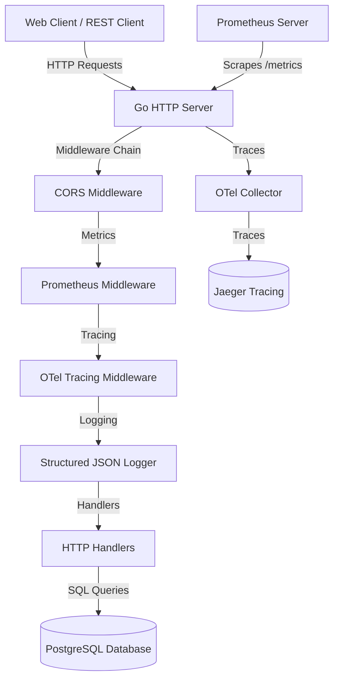

# URL Shortener Backend API

This is the backend API service for the URL Shortener application. It is written in **Go**, utilizing the standard library for HTTP routing and implementing complete structured logging, metrics collection (Prometheus), and distributed tracing (OpenTelemetry).

---

## Tech Stack
* **Language**: Go 1.26
* **Database Driver**: `pgx` (PostgreSQL driver)
* **Metrics**: Prometheus Client Golang
* **Tracing**: OpenTelemetry (OTLP gRPC exporter)
* **Hot Reloading**: `air` (development only)
* **Production Image**: Distroless Static Debian 12 (minimal, secure, non-root)

---

## Architecture Diagram



---

## Running Locally

### Option A: Via Docker Compose (Recommended)
The backend is configured to run automatically as part of the root [docker-compose.yaml](file:///home/shaharyar/01__git_repos/30-day-30-devops-projects/06__day/docker-compose.yaml).
```bash
# In the project root:
docker compose up --build
```
This launches the backend on port `8080` with hot reloading enabled.

### Option B: Standalone / Bare Metal
1. Make sure you have Go installed (v1.26 or newer) and a PostgreSQL database running.
2. Create or copy the `.env` file into the `backend/` directory:
   ```env
   DB_HOST=localhost
   DB_PORT=5432
   DB_USER=postgres
   DB_PASSWORD=super-secret-password
   DB_NAME=url_shortener
   DB_SSLMODE=disable
   ```
3. Run database migrations to create the `urls` table:
   ```bash
   psql -h localhost -U postgres -d url_shortener -f migrations/001_create_urls.sql
   ```
4. Start the application:
   ```bash
   go run cmd/api/main.go
   ```
   Or use `air` for hot-reloads:
   ```bash
   air
   ```
The server will start listening on port `8080`.

---

## Running in Production

### Docker Build
The Dockerfile uses a multi-stage build. The production stage compiles the binary statically and packs it inside a secure, nonroot distroless container:

```bash
# Build the production target image
docker build --target production -t url-shortener-backend:latest .

# Run the container
docker run -p 8080:8080 \
  -e DB_HOST=postgres-host \
  -e DB_PORT=5432 \
  -e DB_USER=postgres \
  -e DB_PASSWORD=your-db-password \
  -e DB_NAME=url_shortener \
  -e OTEL_EXPORTER_OTLP_ENDPOINT=otel-collector.monitoring.svc.cluster.local:4317 \
  url-shortener-backend:latest
```

### Kubernetes Deployment
- In production, the backend is deployed into a Kubernetes namespace via the Helm chart. - Secrets (such as database credentials) are injected dynamically at runtime using HashiCorp Vault.
