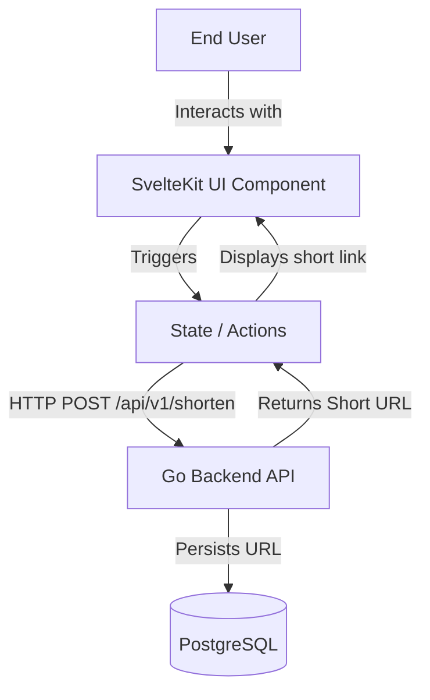

# URL Shortener Frontend

This is the web client frontend for the URL Shortener application. It is built as a single-page application (SPA) using **SvelteKit** and styled with **Tailwind CSS**.

---

## Tech Stack

- **Framework**: SvelteKit (Svelte 5)
- **Build Tool**: Vite
- **Styling**: Tailwind CSS
- **Language**: TypeScript
- **Runtime**: Node.js 24 (production)

---

## Architecture Diagram



---

## Running Locally

### Option A: Via Docker Compose (Recommended)

The frontend is pre-configured to run alongside the API and database services using Docker Compose.

```bash
# In the project root:
docker compose up --build
```

This serves the frontend at [http://localhost:5173](http://localhost:5173).

### Option B: Standalone / Bare Metal

1. Make sure you have **Node.js** (v24 or newer) installed.
2. Navigate to the `frontend` folder:
   ```bash
   cd frontend
   ```
3. Install dependencies:
   ```bash
   npm install
   ```
4. Define the backend API endpoint (default is `http://localhost:8080`):
   ```bash
   export VITE_API_URL=http://localhost:8080
   ```
5. Start the Vite local development server:
   ```bash
   npm run dev
   ```
   Open [http://localhost:5173](http://localhost:5173) in your browser.

---

## Running in Production

### Docker Build

The production Dockerfile builds the static assets and starts a Node production server using the SvelteKit build output:

```bash
# Build the production target image
docker build --target production -t url-shortener-frontend:latest .

# Run the container (listening on port 3000)
docker run -p 3000:3000 \
  -e VITE_API_URL=http://your-production-backend-api \
  url-shortener-frontend:latest
```

### Kubernetes Deployment

- In production, the frontend is deployed to Kubernetes via the Helm chart.
- It runs 2 replicas by default and is exposed via a Kubernetes Ingress Controller.
