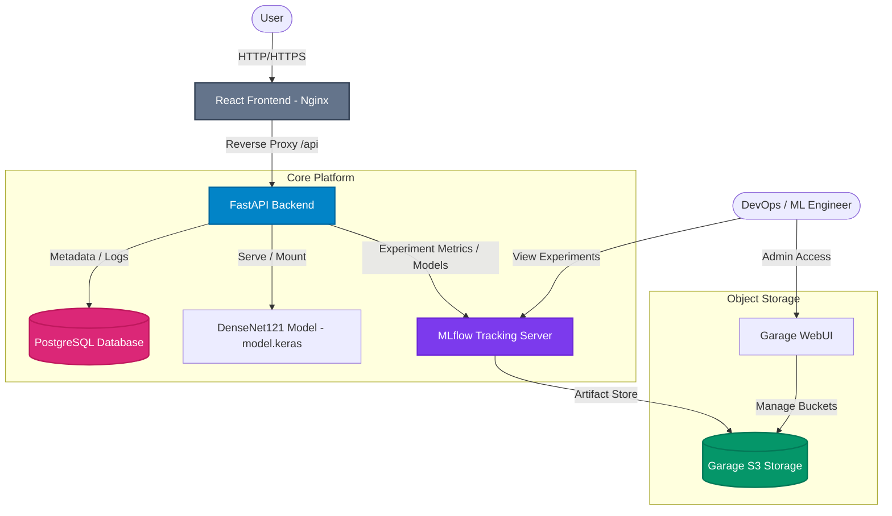

# Medical Image Classification & MLOps Platform

A complete, end-to-end medical image classification platform designed to serve a chest X-ray classifier (using a DenseNet121 model) while integrating model lifecycle management, object storage, and experimental tracking.

This project was built and optimized as a part of a Devops engineering implementation pipeline.

---

## 🏗️ Platform Architecture



The application is orchestrated using Docker Compose and consists of the following services:

1. **Frontend (`frontend`)**: React + TypeScript client served using an optimized Nginx server, exposing the web interface for uploading X-rays and displaying predictions.
2. **Backend (`backend`)**: FastAPI web server serving predictions, managing artifact routing, and communicating with databases.
3. **MLflow (`mlflow`)**: Tracking server to record model runs, metrics, and parameters, integrated with PostgreSQL and Garage storage.
4. **Garage S3 Storage (`garage`)**: Minimal, robust S3-compatible self-hosted object storage solution for storing MLflow artifacts and datasets.
5. **Garage UI (`garage-ui`)**: WebUI dashboard to manage S3 buckets, tokens, and storage keys.
6. **PostgreSQL Database (`postgres`)**: Database storing backend metadata and MLflow experiment schema.


---

## ⚡ Dockerfile Optimizations Applied

Both backend and frontend services have been optimized for high performance, reproducible builds, minimal footprint, and advanced security configurations.

### 🐍 Backend Optimizations
* **Multi-Stage Build**: Separation of compile-time (`build-essential`) dependencies from the final lightweight `python:3.11-slim` runner stage. This reduced the base image footprint significantly.
* **No `curl` Vulnerabilities**: Eliminated the need to install external curl binaries inside the final runner stage. Container health checking is performed via a custom Python script using native `urllib.request`.
* **Fast caching**: Implemented `uv` package manager with Docker cache mounts (`--mount=type=cache,target=/root/.cache/uv`) for ultra-fast dependency resolution and build times.
* **Resiliency**: Created automatic build-time directories like `/app/artifacts` to guarantee FastAPI mounts succeed without needing host directories.

### ⚛️ Frontend Optimizations
* **Bun Dependency Cache**: Utilized Docker's cache mount (`--mount=type=cache,target=/root/.bun/install/cache`) for `bun install`, shortening incremental compilation times to a few seconds.
* **Nginx Base Image Pinning**: Base image pinned to `nginx:1.27-alpine` to prevent breaking changes from upstream Nginx latest releases.
* **Health Check & Log Optimization**: 
  * Replaced the generic `index.html` health check with a specific Nginx `/health` route.
  * Disabled access logging for `/health` queries to keep Docker logs clean and prevent spam.
  * Used IP-based querying (`127.0.0.1`) for health checks to bypass IPv6 loopback mismatch issues in Alpine Linux.

---

## 🚀 How to Run the Platform

### Prerequisites
* Docker and Docker Compose installed.
* `.env` file populated with database passwords and credentials (copy and adjust from `.env` template if applicable).

### Quick Start

1. **Build all images**:
   ```bash
   docker compose build
   ```

2. **Launch all services in the background**:
   ```bash
   docker compose up -d
   ```

3. **Verify the status of the containers**:
   ```bash
   docker compose ps
   ```
   All containers (excluding temporary startup jobs) should show a `healthy` or `running` state.

---

## 🔗 Port Mapping Reference

| Service | Port (Host) | Description |
|---|---|---|
| **Frontend UI** | `5173` | Main Web Application |
| **Backend API** | `8000` | FastAPI Backend and Swagger Docs |
| **MLflow Server** | `5000` | Experiment and Model Registry tracking dashboard |
| **Garage WebUI** | `3000` | Dashboard for S3 storage configuration |
| **Garage API (S3)** | `3900-3902` | Garage storage RPC, CLI, and API endpoint endpoints |
| **Postgres Database**| `5432` | Storage metadata and schemas |
