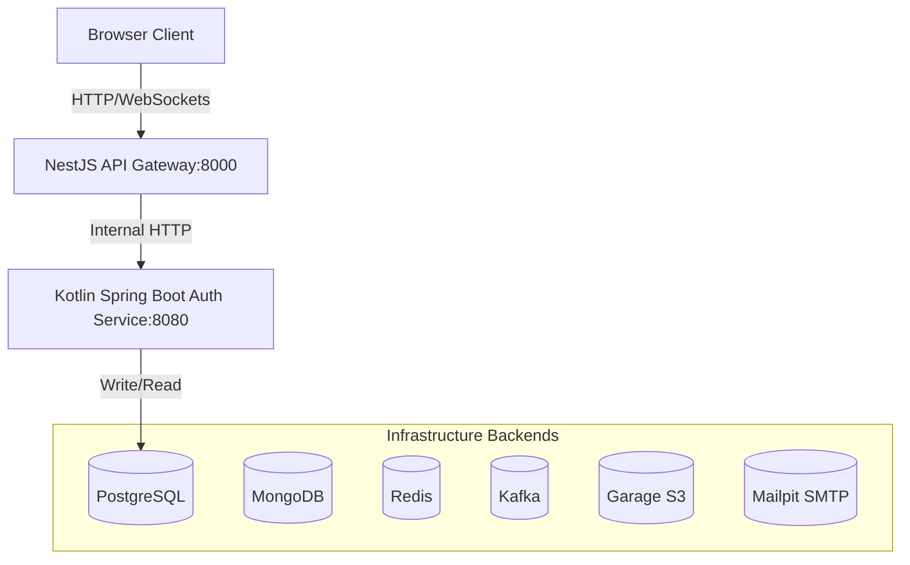

# System Architecture

This document describes the high-level architecture of the platform.

## Architecture Layers

### 1. Presentation Layer (Frontend)

- **Technology**: TanStack Start (React, Vite, SSR, Vinxi).
- **Description**: Highly responsive single page application with server-side rendering for optimal load performance and SEO.
- **Port**: Local access at `http://localhost:3000`.

### 2. Edge / Gateway Layer

- **Technology**: NestJS with HTTP Proxying middleware.
- **Responsibilities**:
  - Central ingress point for all HTTP requests.
  - Rate limiting of client traffic.
  - JWT authorization header validation.
  - Service dispatch proxying (e.g. forward `/api/v1/auth/*` requests to Auth Service).
  - Structured request logging (JSON formatted).
- **Port**: Local access at `http://localhost:8000`.

### 3. Core Microservices Layer

- **Auth Service**:
  - **Technology**: Kotlin, Spring Boot 3.x, Spring Security.
  - **Responsibilities**: User account lifecycle management, credential validation, JWT token minting and validation.
  - **Database**: Dedicated PostgreSQL database.
  - **Port**: Local access at `http://localhost:8080`.

### 4. Shared Infrastructure Layer

- Databases (PostgreSQL, MongoDB)
- Caching & Session Stores (Redis)
- Event Broker (Kafka)
- Object Storage (Garage S3)
- Developer Utility tools (Mailpit for mail capture, Observability stack: Prometheus, Grafana, Loki, Jaeger)
